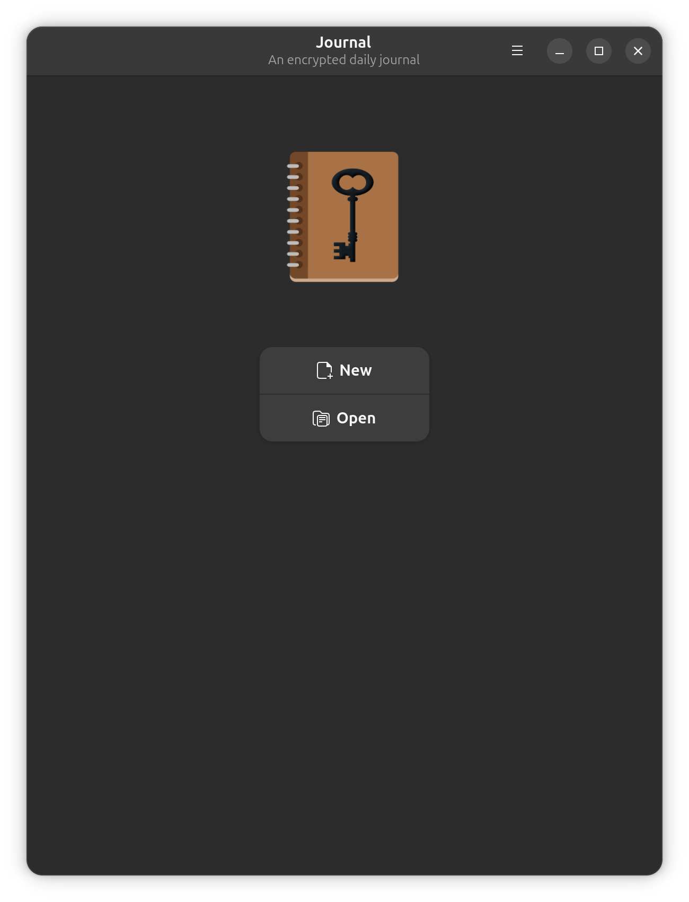
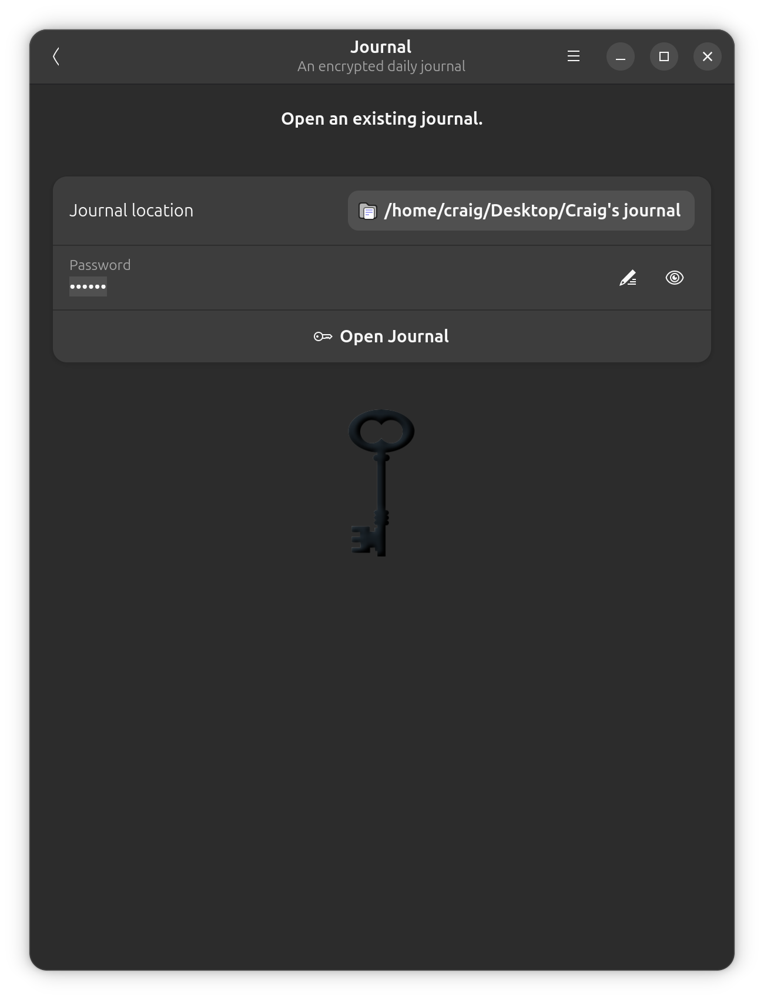
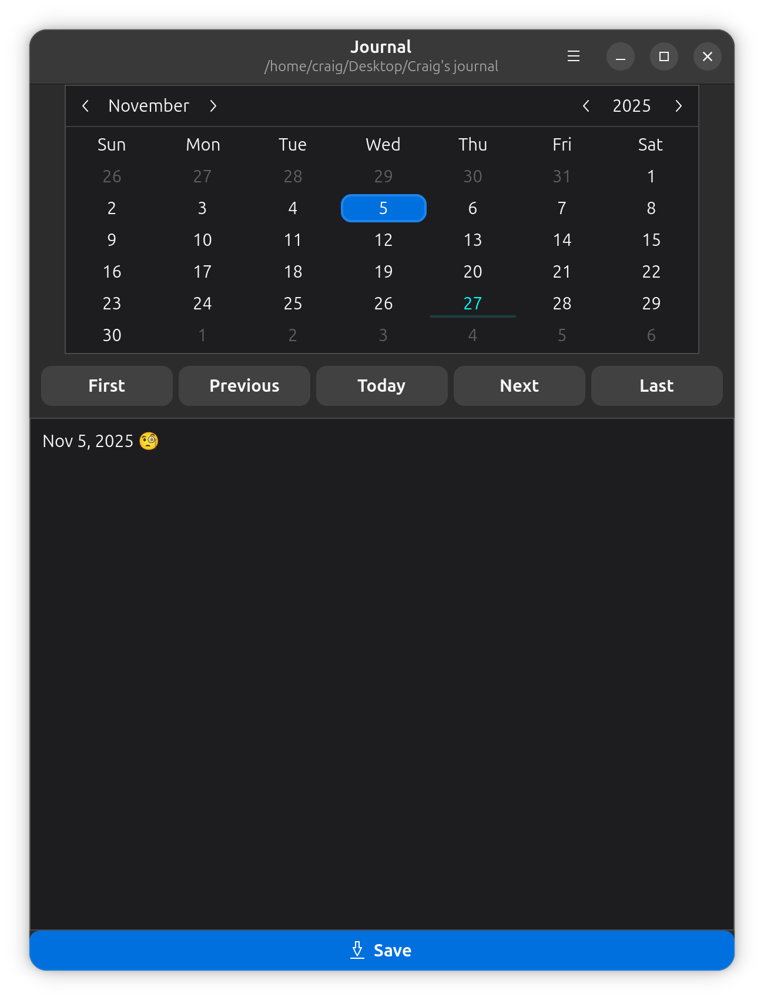

# Journal

## An encrypted daily journal for flatpak.

Written in Java using [Java-GI](https://https://java-gi.org/) Gtk/Adw bindings and packaged as a flatpak. It uses the [flatpak-maven-plugin](https://github.com/CraigFoote/flatpak-maven-plugin) to create flatpak artifacts. Have a look at this project's `pom.xml` configuration for details.

The code is compiled with Java 25 (the minimum for Java-GI is 22) and is packaged in a flatpak container with runtimes *org.gnome.Platform* 49, *org.gnome.Sdk* 49, and *org.freedesktop.Sdk.Extension.openjdk25* that includes the openjdk-25 JRE that runs the Journal application.

The encryption-by-password algorithm should provide privacy. The files used can be named anything and is just a plain text Java Properties file, e.g.:

```properties
#Wed Nov 05 15:24:00 EST 2025
2025-09-20=G6b9lzbW159Iz4ECDIv6PuJpLQQ2PnJMgQh5y7MCAfzetPZfqKOfb4c/1WLhyNhwsw\=\=
2025-09-24=JblFzDbfBE5DyGKjyBQ4PPCFOePILMaWYevYH2TF9o4+bxAATFdYgUnhAEpBfsCdCA\=\=
```

As you can see, the keys are the entry dates and the entries are encrypted text. Journal decrypts the contents for display when the entry date is clicked in its calendar. Entered entries are encrypted and saved to file with that date as key. Clearing the text of an entry and saving removes that file entry.

## Prerequisites

You'll need [flatpak](https://flathub.org/setup) installed to install and run the .flatpak file available on the [Releases](https://github.com/CraigFoote/ca.footeware.javagi.journal/releases) page.

### Releases

You'll find a .flatpak file in each release in the [Releases](https://github.com/CraigFoote/ca.footeware.javagi.journal/releases) page. Downloading and double-clicking it should open it in the GNOME Software application allowing installation.

### Building

If you want to build it yourself, you'll need Java JDK 25 installed. And maven and git, either installed in the eclipse IDE or as separate installs. The `flatpak-maven-plugin` requires `org.flatpak.Builder` be installed as well, via `flatpak install org.flatpak.Builder`. Then you can clone this git repository and build it locally.

#### flatpak-maven-plugin

The [flatpak-maven-plugin](https://github.com/CraigFoote/flatpak-maven-plugin) hasn't been released yet but the snapshot can be used via a `pluginRepositories` block at the root of your pom.xml:

```xml
<pluginRepositories>
    <pluginRepository>
        <id>central-snapshots</id>
        <url>https://central.sonatype.com/repository/maven-snapshots/</url>
        <snapshots>
            <enabled>true</enabled>
        </snapshots>
    </pluginRepository>
</pluginRepositories>
```

Version 1.2.0 of the `flatpak-maven-plugin`  builds the `/target/app` folder with three goals:

- `prepare-build` - Generate flatpak artifacts required for `flatpak-builder`.
- `build-repo` - Calls `flatpak-builder` to create a flatpak repository from the prepared artifacts.
- `export-flatpak` - Calls `flatpak` to build a .flatpak bundle from the repo.

Along the way you may get some errors about missing flatpak runtimes. These can be fixed by installing them via, e.g.:

```bash
flatpak install flathub org.gnome.Platform
```

If you're using eclipse, use the `javagi.journal-BUILD.launch` run configuration. Or run at the project root:

```bash
mvn clean package
```

This executes the three goals populating the `/target/app` folder with artifacts including a `ca.footeware.javagi.journal.flatpak` file. 

This command took over two minutes on my laptop (🤔) with the last goal providing no progress or debug information but it did eventually return.

## Debugging

### Running Locally

When the flatpak is built, the gschema file is copied to `/app/share/glib-2.0/schemas/` and `glib-compile-schemas` is run, making the schema available. If you want to run the Journal application before building a flatpak, there is an eclipse `javagi.journal-RUN.launch` configuration for that. But you need to copy the gschema to `/usr/share/glib-2.0/schemas/` and run `glib-compile-schemas` there, i.e. from `/src/main/resources`:

```
sudo cp ./ca.footeware.javagi.journal.gschema.xml /usr/share/glib-2.0/schemas/
sudo glib-compile-schemas /usr/share/glib-2.0/schemas/
```

### Warehouse

[Warehouse](https://flathub.org/apps/io.github.flattool.Warehouse) is a great program to manage flatpaks, including verifying installation, running and removal.

### Source verification

The first goal, `prepare-build`, results in a `/target/app/` folder. Its contents can be examined and this command run from there can provide some help: 

```xml
flatpak run --command=flatpak-builder-lint org.flatpak.Builder appstream ca.footeware.javagi.journal.metainfo.xml
```

### Container info

`flatpak info ca.footeware.javagi.journal`

### Attach to Container

`flatpak run --command=sh ca.footeware.javagi.journal`. Once connected, `cd /app` to see your files. You can check the version of java installed in `/app/jre`.

## Running the Flatpak

The build result is a 60MB **ca.footeware.javagi.journal.flatpak** file. It can be copied elsewhere or double-clicked to open in GNOME Software for installation. Installed size is ~256MB. It installs a launcher and icon in the GNOME Overview application grid.

## GUI






## Removing

To remove this fine piece of work, use Warehouse or run:

```
flatpak uninstall --delete-data ca.footeware.javagi.journal
```

## TODO

- Code tweaks.
- Release *ca.footeware.javagi.journal.flatpak* to [Flathub](https://flathub.org) for easy distribution and installation on clients.

---
